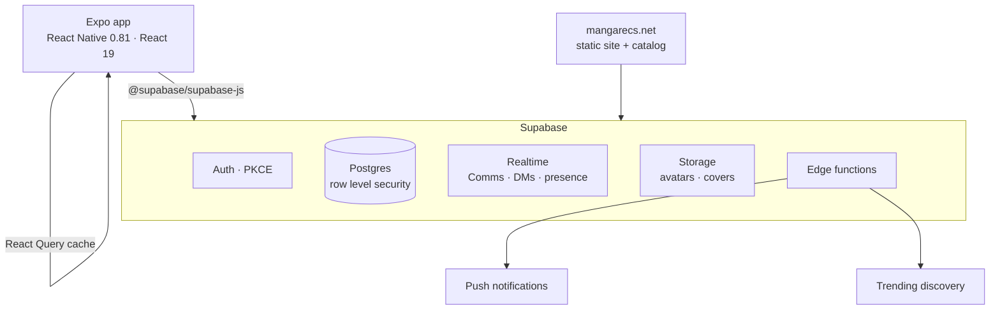

<div align="center">


# MangaRecs

**Your next story, recommended.**

The social home for your manga & manhwa library — track what you're reading, "Rec" titles to friends, talk chapters in Comms, and climb the badge ladder. Read anywhere on the web when you're ready, right in the app. Available on the app, or browse the catalog on the web at [mangarecs.net](https://mangarecs.net).

[](https://expo.dev/artifacts/eas/jHoeEpfFggIJWYDvOF2IE2cU1tBU3KQVT744y_WrzN0.apk)
[](https://mangarecs.net)


</div>

---

## Screenshots

| | | |
|---|---|---|
|  |  |  |
|  |  |  |

## Features

| | |
|---|---|
| **Library that follows you** | Reading, completed, bookmarked and downloaded shelves that survive a lost phone, and that friends can actually see. |
| **Real recommendations** | See what friends are deep in right now, not what they finished months ago. Send a chapter that wrecked you, or Rec a whole series. |
| **Comms** | Threaded discussion per series and per chapter, plus direct messages, with moderation and reporting built in. |
| **For You** | A swipe feed that re-reads your library with every card. Swipe right to save, left to skip, tap a mood chip to reshuffle. |
| **250 badges** | Bronze through Mythic, plus reading streaks — the groundwork for the community events we're building next. |
| **MangaRecap** | A year-in-review your reading actually earns, with music and motion. |
| **Read in-app** | Open a chapter on a verified source without leaving the app, with ads blocked at the network layer. |
| **Six languages** | English, Japanese, Korean, Chinese, Spanish and French, enforced by a strict i18n check in CI. |

## Architecture



The app is a single Expo project. Screens talk to Supabase directly through the JS client — there is no bespoke API server — and every table is guarded by row level security, so the client only ever sees rows it is allowed to see. React Query owns caching and refetching; realtime channels drive Comms, DMs and presence. Six Supabase edge functions carry the work that cannot run on a phone: `chapter-push`, `notify-user`, `refill-feed-videos`, `report-alert`, `streak-reminder` and `trending-discovery`.

Releases ship as EAS builds, and JS-only changes ship over the air through `expo-updates` with a fingerprint runtime policy, so most fixes reach installed apps without a reinstall.

### Project structure

```
screens/        22 screens, one file per route
components/     shared UI
utils/          i18n, theming, badges, recap engine, library rules
supabase/       edge functions and seed SQL
scripts/        catalog generation, pool seeding, i18n and a11y checkers
__tests__/      jest suites for the logic that must not regress
docs/           mangarecs.net — marketing site, catalog and legal pages
cloudflare/     worker in front of the site
legal/          privacy policy, terms, community guidelines
```

## Getting started

```bash
git clone https://github.com/mechbydestine/MangaRecs.git
cd MangaRecs
npm install
npx expo start
```

Press `a` for Android, `i` for iOS, or scan the QR code with Expo Go. No secrets to configure — the client ships with Supabase's publishable key, and row level security is what actually protects the data.

| Command | What it does |
|---|---|
| `npm start` | Expo dev server |
| `npm test` | Jest suites |
| `npm run check:i18n` | Fails on any untranslated or orphaned key |
| `node scripts/check-a11y.js` | Touch targets, labels, roles |
| `node scripts/check-contrast.js` | Contrast ratios in both themes |
| `node scripts/check-hardcoded-strings.js` | Catches strings that skipped i18n |
| `npx eas-cli build --platform android --profile preview` | Installable APK |
| `npx eas-cli update --branch preview -m "what changed"` | Over-the-air update |

Build profiles, the versioning rules and the fingerprint setup are documented in [DEVELOPMENT.md](DEVELOPMENT.md).

## Quality gates

Logic that would be expensive to get wrong is covered by jest: badge awards, library eligibility and import, the recap engine and its release window, reader utilities, moderation, and accessibility. Alongside those, the checker scripts above keep six languages in sync, keep contrast and touch targets honest in both themes, and stop hardcoded English from shipping.

## Localization

Translations live in `utils/translations/` — `en`, `ja`, `ko`, `zh`, `es`, `fr`. Add a key to `en.js`, run `npm run check:i18n`, and it will tell you exactly which languages are missing it. The marketing site carries its own dictionary in `docs/assets/i18n.js`.

## Team

MangaRecs is built by a small team of manga and manhwa readers. We kept losing track of what we were reading across a dozen sites and thirty open tabs, and every app we tried was either a spreadsheet with a login or too much slop to find anything worth reading — so we started building the one we actually wanted.

Issues and feature requests are welcome. If you want to work on something, open an issue first and we'll point you at the right files.

## Legal

[Privacy policy](https://mangarecs.net/privacy/) · [Terms](https://mangarecs.net/terms/) · [Community guidelines](./legal/)

MangaRecs does not host manga. The app links out to publisher and scanlation sites that readers choose, and shows metadata from public catalogs.

© 2026 MangaRecs. All rights reserved.
