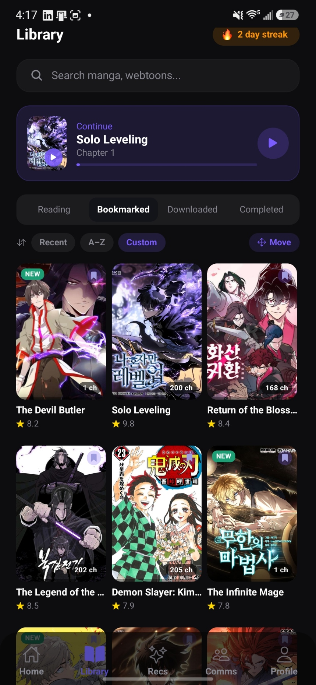
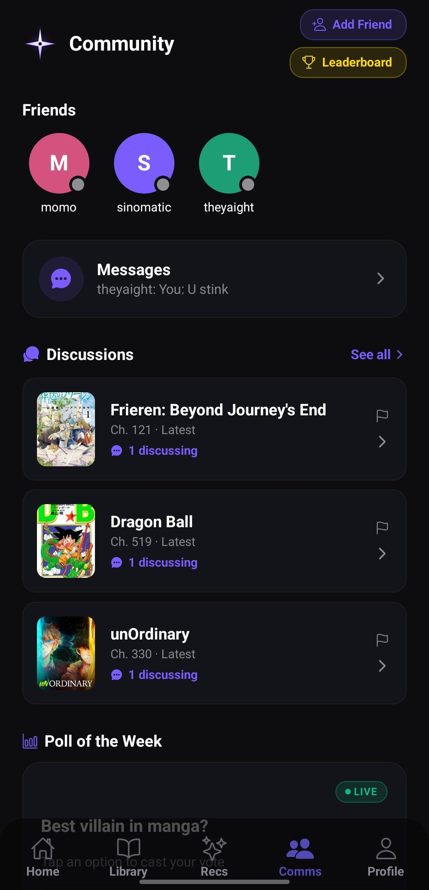
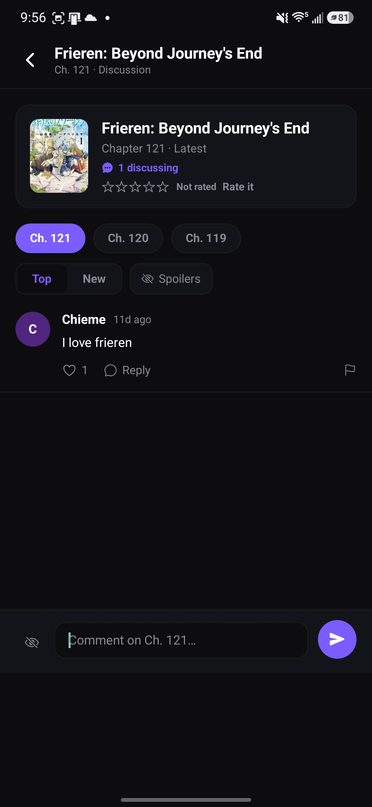
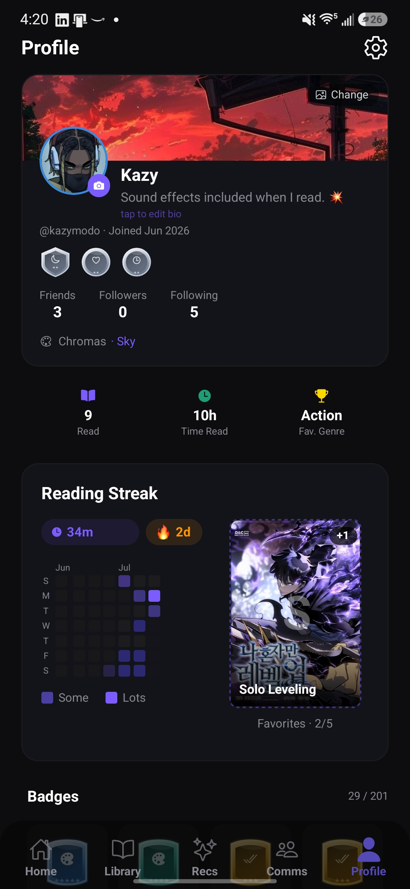
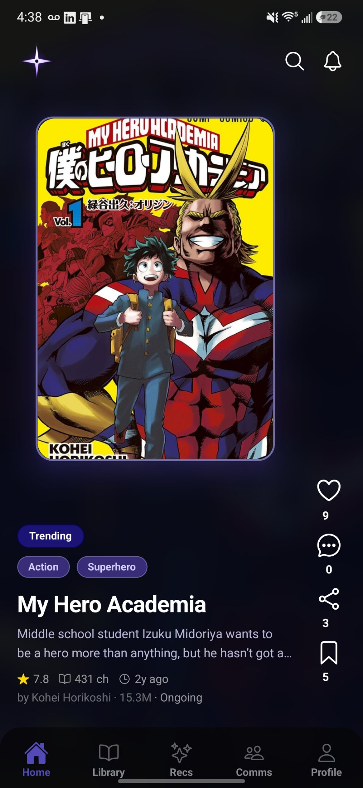
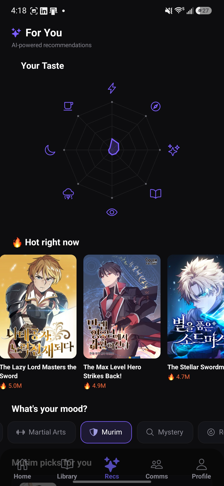

# MangaRecs

**Your next story, recommended.**

The social home for your manga & manhwa library — track what you're reading, "Rec" titles to friends, talk chapters in Comms, and climb the badge ladder. Read anywhere on the web when you're ready, right in the app. Available on the app, or browse the catalog on the web at [mangarecs.net](https://mangarecs.net).

---

## Screenshots

| | | |
|---|---|---|
|  |  |  |
|  |  |  |
