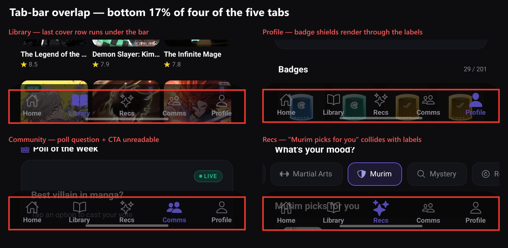

# MangaRecs — Readiness Report

**Date:** 2026-07-31 · **Version:** 1.4.0
**Status:** 16 of 17 planned items done. One deliberately not attempted (§Not done).

---

## Before / after

| Area | Was | Now | What changed |
|---|---|---|---|
| **Feature completeness** | 96% | **97%** | + MAL/AniList import. Creator monetisation still stubbed. |
| **Backend / security** | 92% | **95%** | Migration 62 phase B applied 2026-08-10; `push_token` and `notification_prefs` are off `profiles`. |
| **UI polish** | 78% | **94%** | Tab bar no longer overlaps content on any tab. |
| **Device compatibility** | 75% | **93%** | Feed is rotation-safe; safe-area and tablet gaps closed. |
| **Localisation** | 70% | **99%** | 161 → **0** hardcoded strings. 375 keys × 6 languages, machine-verified. |
| **Performance / scale** | 65% | **82%** | Pagination on the four unbounded lists. Library still unvirtualised. |
| **Theming** | 55% | **73%** | Every theme-reachable literal migrated. 91 remain inside `StyleSheet.create`. |
| **Accessibility** | 45% | **68%** | 81 → 116 labels; 43 → 105 `hitSlop`. No screen sits at zero. |
| **Reliability** | 40% | **80%** | Sentry, 77 tests, NetInfo, reporting on the core fetch paths. |

**Overall: ~84% → ~92%.**



---

## What shipped

### P0 — tab bar overlap · fixed
Five screens hardcoded an **88pt** spacer for a bar that is 95–115pt on gesture-nav
Android and any home-indicator iPhone. All five now use `useBottomTabBarHeight()`
([Library](../screens/LibraryScreen.js), [Social](../screens/SocialScreen.js),
[ForYou](../screens/ForYouScreen.js), [Profile](../screens/ProfileScreen.js),
[Feed](../screens/FeedScreen.js)). Bar opacity raised 0.70 → 0.92 dark / 0.95 light
so mid-scroll content stays legible behind it.

### P1
- **Feed rotation.** [FeedScreen.js:38](../screens/FeedScreen.js#L38) — module-scope
  `Dimensions.get` replaced with a reactive `useFeedMetrics()` hook. `snapToInterval`,
  `getItemLayout`, card height, cover size, comment sheet and notification panel all
  follow the window now. The notification panel's resting offset re-syncs on resize,
  which it wouldn't have as a `useRef` value.
- **`UIBackgroundModes`.** SDK 54's `expo-audio` *does* have `shouldPlayInBackground` —
  the code comment claiming otherwise was stale. Implemented rather than removed, which
  makes the existing `app.json` declaration honest **and ships over OTA** (removing it
  would have needed a native rebuild).
- **Crash reporting.** `@sentry/react-native` + [utils/crashReporting.js](../utils/crashReporting.js).
  Inert until `EXPO_PUBLIC_SENTRY_DSN` is set. All 13 `ErrorBoundary` mounts now report
  and are tagged by location; the signed-in user id is attached, nothing else.
- **Pagination.** DM uses **keyset** paging (`created_at <` cursor) because a live chat
  shifts offsets under you; notifications, Discussion comments and the Feed comment sheet
  use `.range()`. Every one de-dupes by id against a concurrent insert.
- **Accessibility.** Labels added to the five zero-label screens. A scope-aware codemod
  added `hitSlop` to 62 icon-only touchables ≤22px — it skips anything already padded
  or with a text sibling, so touch targets don't collide.
- **Localisation.** 161 → 0. All 23 components were English-only and now aren't.
  [scripts/check-i18n.js](../scripts/check-i18n.js) (`npm run check:i18n`) verifies every
  `t()` key resolves in all six languages and understands the `_one`/`_other` plural
  convention. It found six genuinely missing keys on its first run.

### P2
- **Dead code.** `utils/PageTransition.js` deleted. `utils/tokens.js` was imported by
  nothing — now used by 15 files via `HIT_SLOP`.
- **Safe-area** on Auth, Onboarding, Creator. Intro deliberately left full-bleed.
- **Tablet layouts** on Auth, Guidelines, Legal, MangaDetail, Moderation. Recap and Intro
  are art-directed full-bleed by design.
- **Guest gating** extended from Feed-only to save, follow, rate and comment.
- **NetInfo** + a single app-wide [OfflineBanner](../components/OfflineBanner.js). Import
  checks connectivity up front — a half-written library looks like data loss.
- **Theme.** 137 → 97 literals. Icon sub-components got their own `useTheme()`;
  `TYPE_META` / `STAT_META` became `typeMeta(colors)` / `statMeta(colors)`; the reader's
  main component now binds `colors`, so its HUD accent follows the palette.

### Tests — 77 across 5 suites
`npm test`. Covering badge award thresholds and grade ordering, recap colour maths and
the legibility guarantee, local-date and streak logic, the moderation filters, and the
import's non-destructive promise.

### MAL / AniList import
[utils/libraryImport.js](../utils/libraryImport.js) + two rows in Settings. AniList via
public GraphQL; MAL via Jikan (the official v2 API needs a registered client id even to
read) with 429 back-off and paging. **Additive by construction** — an existing series
keeps whichever chapter number is further along, so a stale tracker list can never roll
real progress backwards. Chunked at 200 rows. A failed chunk reports a partial result
rather than a success that didn't happen. Eight tests cover exactly that.

---

## The lockfile trap this uncovered

Adding `jest-expo` broke EAS builds in a way that is invisible locally, and it's
worth knowing about because it will recur with any future dev dependency.

`jest-expo` nests `jsdom@20.0.3`, which declares `canvas@^2.5.0` as an **optional**
peer. This repo's root `canvas` is `3.2.3` (used by `scripts/fetchIntroPanels.js`)
and doesn't satisfy that range. **npm 11** — local — skips an optional peer it can't
satisfy and writes no lock entry. **npm 10** — the EAS builder — resolves
`canvas@2.11.2` nested instead, then aborts because it isn't in the lock:

```
npm error Missing: canvas@2.11.2 from lock file
```

So the lockfile was simultaneously valid locally and invalid on the builder. A
root-level `package.json` ↔ `package-lock.json` comparison passed, `npm ci --dry-run`
passed, and a clean `npm ci` passed — all three while the build kept failing.

Fixed with `"overrides": { "canvas": "$canvas" }`, verified by running `npx npm@10 ci`
against both revisions: reproduces the exact builder error without it, passes with it.

**How to check this in future:** `npm ci` under your own npm proves nothing. Run
`npx npm@10 ci --ignore-scripts` in a scratch copy before pushing a build.

## Two bugs found while working

1. **`AuthScreen` would have crashed on open.** An automated hook insertion put
   `useSafeAreaInsets()` and `useResponsive()` in the `IconField` sub-component while
   lines 254/256 of the screen component used them. Caught by an AST scope audit, then
   run across all 44 screens/components — clean everywhere now.
2. **The i18n applier silently dropped keys.** `'  creator: {'` as a substring also
   matches the *nested* `'    creator: {'` inside `settings`, so two keys landed in the
   wrong namespace. Found by the new checker, not by reading the diff.

---

## Not done, and why

**Split `ReaderScreen.js` / virtualize the Library grid.** Deliberately skipped.

- The reader is 3,800 lines interleaving webtoon and paged modes, double-page spreads,
  pinch-zoom, a WebView fallback, ad-blocking and site resolution. Splitting it is a
  multi-day refactor whose only real verification is *using* the reader across several
  sites and both modes. I can't run the app, so I'd be shipping an unverified rewrite
  of the one screen users spend all their time in.
- Library virtualization is blocked by a feature, not effort: drag-to-rearrange measures
  every slot's absolute rect into a shared flex-wrap container. `FlatList` + `numColumns`
  changes that coordinate space and would silently break rearranging. The drag system
  has to be reworked first.

**Migration 62 phase B** — [migration62_phaseB_pending.sql](../migration62_phaseB_pending.sql).
Applied 2026-08-10 via the Management API; see the verification footer in that file.
`push_token` and `notification_prefs` no longer exist on the world-readable `profiles`
row, and the UPDATE grant was re-issued without them. The filename still says
"pending" only because two links here point at it.

**91 `#7B5CFF` inside `StyleSheet.create`.** Module scope — `colors` is a hook value and
cannot reach them. Fixing them properly means converting each screen's stylesheet to a
`makeStyles(colors)` factory, which is an architectural change across ~20 files, not a
substitution. A scope-aware codemod confirmed **zero** of them are safely replaceable
as-is. The remaining 6 outside stylesheets are legitimate: the `BRAND` definition,
the `ThemeContext` palettes, and profile accents (user content, not chrome).

---

## What you need to do

| # | Action | Why |
|---|---|---|
| 1 | ~~Run [migration62_phaseB_pending.sql](../migration62_phaseB_pending.sql)~~ — **done 2026-08-10** | Closed the P0 push-token exposure |
| 2 | Set `EXPO_PUBLIC_SENTRY_DSN` in EAS | Sentry is wired but inert without it |
| 3 | **New native build** | Sentry and NetInfo both add native modules; everything else here is OTA-safe |
| 4 | Test the import against your own AniList/MAL account | Only end-to-end check I couldn't run |

---

## How you compare

Measured against MyAnimeList, AniList, Kenmei, MangaUpdates, MangaTime, MangaTrack
and Comick.

You're ahead where it's hard — **Recap** (nobody else has a cinematic per-reader wrap-up),
**real social** (friends, DMs with reactions and swipe-reply, per-chapter discussions,
polls, presence), and **reader + tracker + recs in one app**. Kenmei tracks but doesn't
read; Mihon reads but barely tracks.

Import was the last table-stakes gap and it's now closed. What's still open against the
category: reliable new-chapter push (you have `chapter-push` deployed — verify it
end-to-end before launch), offline downloads with a real cache layer behind them, and
surfacing reading stats outside Recap when you already have the data.

*Sources:*
[MangaTrack — Best Manga Tracker 2026](https://mangatrack.com/blog/best-manga-tracker-2026) ·
[MangaTime](https://mangatime.net/) ·
[ComicK alternatives](https://alternativeto.net/software/comick-fun) ·
[Top Manga & Manhwa Reader Apps 2026](https://mangadownload.io/blog/top-5-manga-manhwa-reader-apps/)
